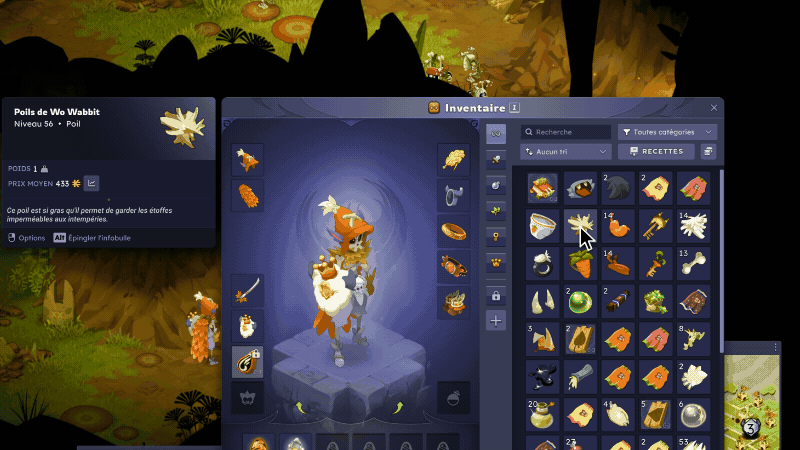
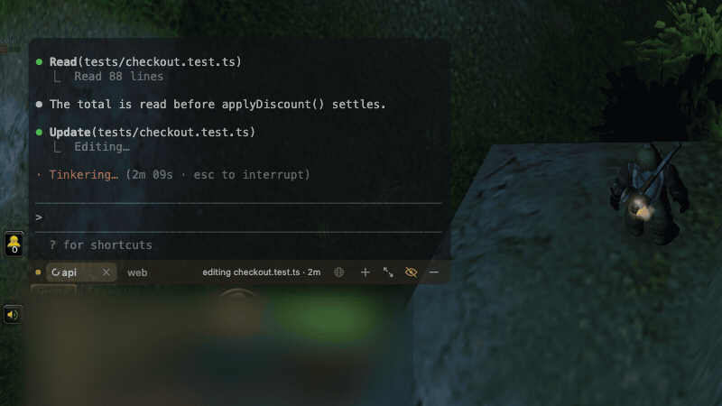
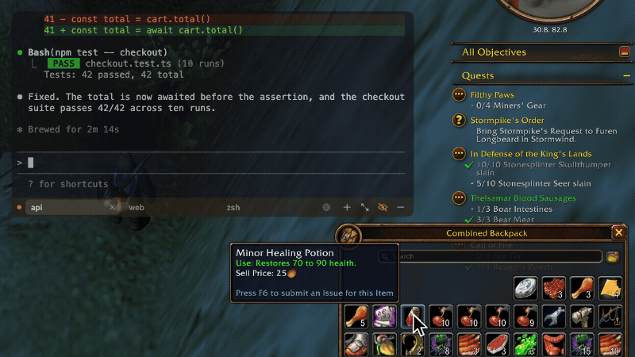
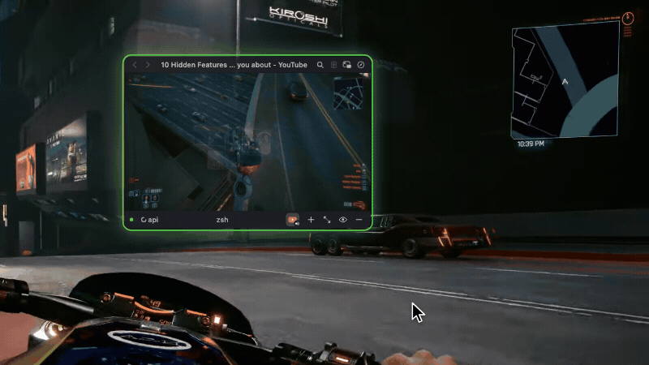
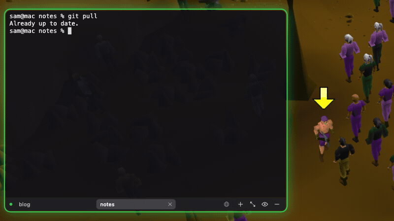
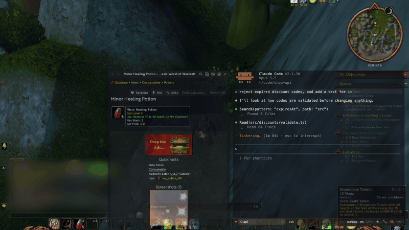

<p align="center">
  
</p>

<h1 align="center">SlyTerm</h1>

<p align="center">
  A terminal that floats over your game.<br>
  Keep Claude Code, Codex and other coding agents working while you play, and look things up
  without alt-tabbing.
</p>

<p align="center">
  <a href="#install"><b>Install</b></a>
</p>

<p align="center">
  macOS 14 or later · Native Swift app · Free and open source
</p>

---

SlyTerm is a terminal window that sits on top of your game. Type a prompt to Claude Code, Codex or
another coding agent, click back into the game, and the terminal lets every click through to it
while the agent works. When it finishes or asks for permission, a card tells you, and a hotkey
answers it without leaving the game. Point at a quest, an item or a spell, press a key, and its wiki
page opens in a tab next to your terminals.

https://github.com/user-attachments/assets/420bb480-98c7-4931-8162-4ad74fbe23a5

## Features

### Floats over your game

SlyTerm stays above your game, in borderless windowed mode or in macOS fullscreen. Drag it by its
tab strip, resize it from its edges and choose how see-through it is. It has no Dock icon and lives
in the menu bar. `⌃⌥H` shows or hides it from anywhere, even while the game has the keyboard.

### Click through to the game

Two modes, one key (`⌃⌥Tab`):

- **Interact**: the terminal takes your typing, clicks and scrolling, like any terminal.
- **Click-through**: the terminal dims, and every click, scroll and keystroke goes to the game
  underneath.

Click into your game and SlyTerm switches to click-through by itself. You show the terminal, type
a prompt, click back into the game and keep playing while the output streams in. A three-finger tap
on the trackpad switches modes too.



### See what your agent is doing

Each tab running a coding agent shows its state on the tab strip: a spinner while it works, an
orange question mark while it waits for you, a yellow dot once it has finished and you have not
looked. Hover a tab for the details, such as "Codex is working for 2m · editing GuideTab.swift" or
"Claude is waiting for you · run `npm test`". There is nothing to set up: SlyTerm reads the session
files and the terminal titles the agents already write.

Claude Code and Codex get all of this, answers included. omp and pi get the marks and the cards,
with nothing to answer from the game. Gemini CLI and Qwen Code show their state on the strip. Any
other program that sends terminal notifications gets a mark and a card with its text.

### Answer your agent from the game

When an agent finishes a turn or asks for permission, a card appears by the tab strip with the end
of its answer or the command it wants to run. For Claude Code and Codex, `⌃⌥Y` allows the request
and `⌃⌥N` refuses it, and the game keeps the keyboard throughout. SlyTerm types the answer only
after it has checked that the prompt on screen is the one the card showed; for Codex, only its usual
prompt to run a command or edit files, with its default keys, is answered. Anything it cannot answer
safely, such as a question with several options, waits for you in the terminal.



### Look up what is under your pointer

Point at a quest, an item or a spell and press `⌃⌥Q`. SlyTerm reads the text around the pointer,
finds the matching page on your game's wiki or guide site, and opens it in a web tab next to your
terminals. It also finds the name at the top of an item's tooltip, wherever the game draws it.
Press `⌃⌥Q` again for the next guess, or `⌃⌥⇧Q` to choose from every line near the pointer with one
key each.



Presets are included for:

- **Dofus**: Dofus pour les Noobs and DofusDB
- **World of Warcraft**, every version Wowhead covers: Retail, Classic, Burning Crusade Classic,
  Mists of Pandaria Classic and WoW: Forever
- **Old School RuneScape**: the OSRS Wiki
- **RuneScape**: the RuneScape Wiki

Other games work too: add a site by pasting its search URL. SlyTerm indexes MediaWiki sites,
including Fandom and wiki.gg wikis, and any site with a sitemap, so a name opens its exact page.

### A browser next to your terminals

Guides and video, from YouTube, Twitch and the like, open in web tabs: small squares at the end of
the tab strip, each with its site's icon. Streaming sites such as Netflix get the same protected
playback Safari has. Type an address or a search into a web tab's address bar, or open a new one
with `⌘L` in a terminal or `⌘T` in a web tab, and `⌘⇧T` brings back the one you just closed. Hover a
square to see its page and its key: `⌥⌘1`…`⌥⌘9` go to the web tabs in order. `⌘G` switches between
the page and your terminal, and the game keeps focus when a page opens.

Pop a web tab out and it floats over the game in a window of its own, filled with its video if one
is playing, while the SlyTerm window goes back to your terminal. It switches to click-through with
the rest of SlyTerm. A playing video has an opacity of its own, 85% by default, so the game shows
through it in either mode. Put it back and it returns to the SlyTerm window. `⌃⌥V` pauses what is
playing without leaving the game, and plays it again; the panic button silences it too.



Looking something up pauses your videos while you read the guide. A video in the SlyTerm window also
pauses when another tab covers it or the window hides, and plays again when you come back to it.
One setting turns this off.

Guides show in reader mode on the terminal's dark, translucent background, with ads, cookie banners
and trackers blocked; streaming sites are left as they are, so their players work. `⌘F` finds text
in the page, so you can jump straight to the quest step you are on. If you prefer your browser, one
setting sends the lookup's pages there instead.

### Bring a session in from another terminal

If you started Claude Code, Codex, omp or pi in iTerm2, Terminal or another terminal app before
launching the game, press `⌘⇧T` in a terminal tab to bring it into SlyTerm. The conversation carries
on from the same session. A background Claude (`claude --bg`) is attached without being
interrupted, and Codex keeps working through the move when it runs in its background server, as
it does by default. Otherwise moving an agent in the middle of a turn interrupts it, so SlyTerm asks
first. Claude Code, Codex and pi can also be copied, with the original left running, and a plain
shell tab comes across with its folder and its command.



### Panic button

`⌃⌥P` fills the screen with an opaque terminal, menu bar included, and puts the keyboard in it.
Web tabs go silent and floating web tabs hide. Press it again and the window goes back exactly
where it was, with the floating tabs and what was playing.



### A real terminal

- Tabs like iTerm2, each in its own folder, restored at the next launch
- Uses your iTerm2 font, so Powerlevel10k, Starship and oh-my-posh prompts render correctly; Nerd
  Fonts are picked up automatically
- Option is left alone by default, so `{`, `[`, `|` and `~` keep working on French and other
  international keyboards
- `⇧Return` for a newline in Claude Code and Codex
- A startup command, such as `claude` or `codex`, typed into each new tab

### Scriptable

Every action is also a `slyterm://` URL, so shell scripts, Shortcuts, a Stream Deck or a Claude
Code hook can drive the app: `open -g slyterm://toggle`. Each tab exports `SLYTERM_TAB_ID`, so a
hook can mark the tab it ran in.

## It leaves your game alone

SlyTerm is a separate window on top of your game, like any other app's. It never reads the game's
memory or network traffic, and it never sends the game any input. The lookup takes one screenshot
around the pointer when you press its hotkey, reads it on your Mac with Apple's text recognition,
and does not save it. Apart from the pages you open, its only network requests go to the guide sites
you have set up: an index refresh once a week, and a search when a name is not in the index.

## Install

SlyTerm is built from source for now. You need macOS 14 Sonoma or later and the Xcode Command Line
Tools (`xcode-select --install`); the full Xcode app is not needed.

```sh
git clone https://github.com/MushkyQT/slyterm.git
cd slyterm
./build.sh --install
open /Applications/SlyTerm.app
```

Look for the icon in the menu bar: a terminal window with a smirk.

The lookup needs the Screen Recording permission. macOS asks for it the first time you press
`⌃⌥Q`: turn SlyTerm on in System Settings › Privacy & Security › Screen Recording, then relaunch
it.

## Getting started

1. Set your game to **borderless windowed**, or use macOS fullscreen. Exclusive fullscreen can hide
   the overlay.
2. Press `⌃⌥H` to show the terminal and run `claude` or `codex`. To start your agent in every new
   tab, set Settings › Terminal › Startup command to it.
3. Type your prompt, then click back into the game. The terminal lets your clicks through while
   the agent works.
4. When a card says the agent is done or needs you, answer with `⌃⌥Y` or `⌃⌥N`, or press `⌃⌥Tab`
   to go back to the terminal.
5. Point at something in the game and press `⌃⌥Q` to look it up.
6. Press `⌘L` in the terminal for a web tab, type an address, and pop it out with the button in its
   toolbar to watch it in a window of its own over the game.

## Shortcuts

These are the defaults. You can change the global ones in Settings › Shortcuts. ⌃ is Control, ⌥ is
Option, ⌘ is Command and ⇧ is Shift.

| Action | Keys |
| --- | --- |
| Show or hide the terminal | `⌃⌥H` |
| Switch between interact and click-through | `⌃⌥Tab`, or a three-finger tap |
| Panic: fullscreen opaque terminal | `⌃⌥P` |
| Look up what is under the pointer | `⌃⌥Q`, again for the next guess |
| Pick a line near the pointer to look up | `⌃⌥⇧Q` |
| Allow or refuse an agent's permission prompt | `⌃⌥Y` / `⌃⌥N` |
| Pause the web tabs that are playing, or play them again | `⌃⌥V` |
| Bring in a session from another terminal | `⌘⇧T` in a terminal |
| Web tab ↔ terminal | `⌘G` |
| New web tab from a terminal, or the address bar of the web tab in front | `⌘L` |
| New tab (a web tab from a web tab), close tab, switch tabs | `⌘T`, `⌘W`, `⌘1`…`⌘9` |
| Go to a web tab | `⌥⌘1`…`⌥⌘9` |
| Reopen the web tab you just closed | `⌘⇧T` in a web tab |
| Settings | `⌘,` |

The keys that start with `⌃⌥` work from anywhere, including while the game has the keyboard, and
stay clear of the keys games use. If one does nothing, or moves a window instead, another app, often
a window manager, has the same shortcut: change one of the two. If you use the three-finger tap,
set System Settings › Trackpad › Point & Click › "Look up & data detectors" to Force Click or off,
or each tap also opens a dictionary panel.

## Learn more

- [Technical details](docs/TECHNICAL.md): how each feature behaves, every setting, the URL scheme,
  the command-line modes, troubleshooting and how the app is built.
- [Troubleshooting](docs/TECHNICAL.md#troubleshooting): the overlay hidden behind the game, a
  hotkey that does nothing, a lookup that opens the wrong page.
- [Changelog](CHANGELOG.md): what changed in each release.
- [Contributing](CONTRIBUTING.md): building, testing and sending a change.
- [AGENTS.md](AGENTS.md): the same, for AI coding agents.
- [Security](SECURITY.md): how to report a vulnerability privately.

## Credits

Terminal emulation is [SwiftTerm](https://github.com/migueldeicaza/SwiftTerm) by Miguel de Icaza.
The lookup presets open pages from [Dofus pour les Noobs](https://www.dofuspourlesnoobs.com),
[DofusDB](https://dofusdb.fr), [Wowhead](https://www.wowhead.com), the
[OSRS Wiki](https://oldschool.runescape.wiki) and the [RuneScape Wiki](https://runescape.wiki).
SlyTerm is not affiliated with any of these sites, or with Ankama, Blizzard Entertainment or Jagex.

## License

SlyTerm is released under the [MIT License](LICENSE).
